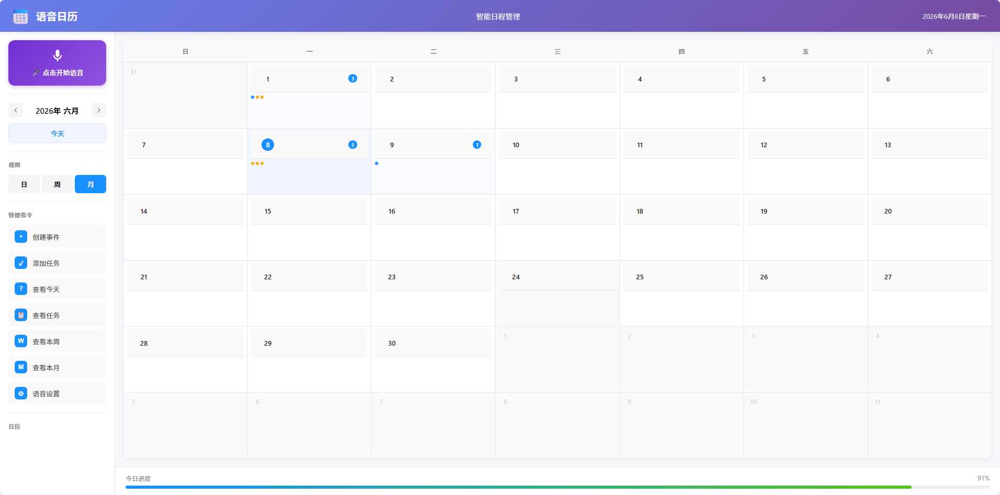
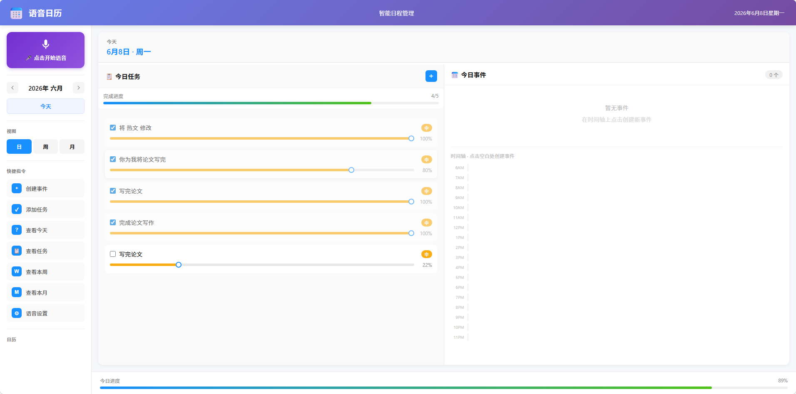
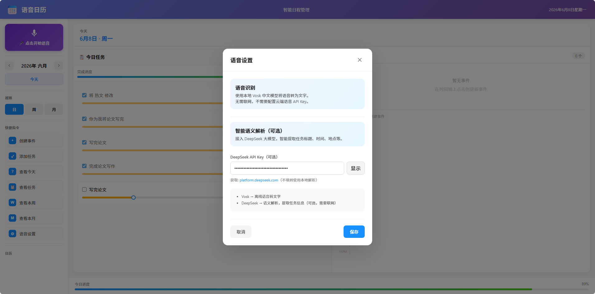

<div align="center">

# 🎙️ 语音日历工具

**一款支持语音交互的智能日程管理应用**

[](https://python.org)
[](https://react.dev)
[](https://typescriptlang.org)
[](https://flask.palletsprojects.com)
[](LICENSE)

<br/>

[功能特性](#-功能特性) • [快速开始](#-快速开始) • [技术架构](#-技术架构) • [使用指南](#-使用指南) • [API文档](#-api文档)

</div>

---

## 📸 页面展示

<div align="center">
  
  <p><em>月视图：查看整月任务与日程分布</em></p>

  
  <p><em>日视图：管理今日任务、任务进度与今日事件</em></p>

  
  <p><em>语音设置：本地 Vosk 语音识别 + DeepSeek 智能语义解析</em></p>
</div>

## 🎬 项目讲解视频

<div align="center">
  <video src="./讲解视频.mp4" controls width="900"></video>
  <p><a href="./讲解视频.mp4">如果视频无法直接预览，可以点击这里查看讲解视频</a></p>
</div>

**视频内容概览：**
- 本地项目文件结构介绍
- 语音日历工具核心功能演示
- 离线语音识别与 DeepSeek 智能语义解析展示

---

## ✨ 功能特性

### 🗓️ 日历管理
- **三种视图**：日视图、周视图、月视图自由切换
- **事件管理**：创建、编辑、删除日程事件
- **事件进度**：每个事件独立进度条，拖动调节完成进度
- **拖拽支持**：周视图支持拖拽调整事件时间
- **多日历**：支持多个日历分类，独立显示/隐藏

### 📋 TodoList 任务管理
- **任务增删改查**：完整的任务管理功能
- **优先级设置**：高/中/低三级优先级，颜色标识
- **进度追踪**：每个任务独立进度条，手动拖动调节
- **整体进度**：自动计算所有任务的平均进度
- **自动顺延**：未完成任务自动顺延到下一天

### 🎙️ 语音交互
- **离线语音输入**：前端录制 WAV，后端使用本地 Vosk 中文模型识别
- **智能语义解析**：可接入 DeepSeek API，理解复杂自然语言指令
- **日程助手问答**：支持询问“明天有什么安排”“这周哪天比较空”“明天天气适合出门吗”
- **结构化结果**：自动提取任务/事件标题、日期、时间、地点、优先级和提醒信息
- **语音反馈**：操作结果语音播报
- **AI 可视化**：实时显示大模型调用状态、推理过程、解析结果

### 🌤️ 日历增强
- **公历 + 农历**：月、周、日视图显示农历日期
- **节假日/节气**：标记常见节日、节气和调休信息
- **实时天气**：优先读取设备定位，按经纬度获取未来天气；超出预报范围显示占位符号

### 📱 安装与同步
- **Windows 桌面版**：支持打包为可直接运行的 exe，也可生成安装包
- **桌面常驻**：桌面版包含后台提醒循环、启动日志、每日自动备份和开机自启开关
- **手机 PWA**：手机浏览器访问电脑局域网地址后可添加到主屏幕
- **局域网同步**：电脑作为数据主机，手机和电脑读写同一个本地数据库
- **数据备份**：设备同步面板可手动创建 SQLite 备份并导出 JSON 数据
- **自动刷新**：多设备打开时会定时刷新事件和任务

### 🎨 现代UI设计
- **渐变配色**：紫色渐变主题，视觉舒适
- **响应式布局**：自适应桌面、平板、手机等多种屏幕
- **流畅动画**：平滑过渡和交互动画

---

## 🚀 快速开始

### 方式一：直接运行 exe（推荐）

1. 从 [Releases](https://github.com/xianyu-sheng/voice_calender_tool/releases) 下载最新版 `语音日历工具.exe`
2. 双击运行即可，无需安装

### 方式二：安装到 Windows

1. 先运行 `build.bat` 生成 `dist/语音日历工具.exe`
2. 运行 `build_installer.bat`
3. 双击 `dist/语音日历工具-Setup.exe` 安装

如果本机装了 Inno Setup，也可以直接编译 `installer.iss` 生成更标准的安装包。

### 方式三：手机安装与同步

1. 电脑和手机连接同一个 Wi-Fi
2. 在电脑上运行桌面版 `语音日历工具.exe`
3. 打开左侧栏「设备同步」，复制显示的 `http://电脑IP:8000` 地址
4. 在手机浏览器打开该地址
5. 使用浏览器菜单里的「添加到主屏幕」或弹窗里的「安装到当前设备」

手机端和电脑端会共用电脑上的 SQLite 数据库，因此新增、修改、删除的日程和任务会同步到另一端。局域网 HTTP 可以同步数据；如果要手机端也稳定使用麦克风、定位和系统级安装能力，建议后续配置 HTTPS 或制作原生移动端壳。

#### Android USB 同步

如果上班路上手机先离线创建任务，到公司后希望插 USB 自动同步，可以使用 Android USB 调试通道：

1. 电脑安装 Android Platform Tools，并确认 `adb` 已加入 PATH
2. 手机上开启「开发者选项」和「USB 调试」
3. 用 USB 连接手机和电脑，在手机弹窗中允许这台电脑
4. 打开电脑端「设备同步」里的「USB 同步」，点击「检测 USB」
5. 手机浏览器打开 `http://127.0.0.1:8000`，或在同步面板复制手机地址

电脑端会尝试执行 `adb reverse tcp:8000 tcp:8000`。手机端如果路上无法连接电脑，语音创建的任务/日程会先进入本地待同步队列；回到公司连上 USB 或局域网后，应用会自动补传到电脑数据库。

### 方式四：源码运行

#### 环境要求
- Python 3.10+
- Node.js 18+
- npm 或 yarn

#### 后端启动

```bash
# 进入后端目录
cd backend

# 创建虚拟环境（可选）
python -m venv venv
venv\Scripts\activate  # Windows
# source venv/bin/activate  # macOS/Linux

# 安装依赖
pip install -r requirements.txt

# 确认离线语音模型存在
# 默认路径：backend/vosk-model/vosk-model-small-cn-0.22

# 配置 API Key（可选，用于大模型解析复杂语音指令）
cp .env.example .env
# 编辑 .env 文件，填入你的 DeepSeek API Key

# 启动后端服务
python main.py
```

后端将在 `http://localhost:8000` 启动

#### 前端启动

```bash
# 进入前端目录
cd frontend

# 安装依赖
npm install

# 启动开发服务器
npm run dev
```

前端将在 `http://localhost:5173` 启动

#### 打包为 exe

```bash
# 确保前端已构建
cd frontend && npm run build

# 返回根目录打包
cd ..
python -m PyInstaller build.spec --noconfirm
```

生成的 exe 文件在 `dist/语音日历工具.exe`

#### 打包为安装包

```bash
# 先生成 exe
build.bat

# 再生成 Windows 安装包
build_installer.bat
```

安装包输出到 `dist/语音日历工具-Setup.exe`

---

## 🏗️ 技术架构

```
D:\语音版的日历工具/
├── app.py                   # 源码运行入口之一
├── desktop_app.py           # 桌面版 exe 运行入口
├── build.bat                # Windows 打包脚本
├── build_installer.bat      # Windows 安装包生成脚本
├── build_installer.ps1      # PyInstaller 安装包构建逻辑
├── build.spec               # PyInstaller 打包配置
├── installer_app.py         # Windows 安装器入口
├── installer.spec           # 安装器 PyInstaller 配置
├── installer.iss            # Inno Setup 安装包配置
├── 语音日历工具.spec          # exe 打包配置
├── 页面展示.png              # README 页面展示图：月视图
├── 页面展示2.png             # README 页面展示图：日视图
├── 页面展示3.png             # README 页面展示图：语音设置
├── 讲解视频.mp4              # 项目讲解视频
│
├── frontend/                # 前端 React 应用
│   ├── src/
│   │   ├── App.tsx          # 主应用组件
│   │   ├── App.css          # 主样式
│   │   ├── components/      # Header、Sidebar、DayView、WeekView、MonthView 等组件
│   │   ├── hooks/           # 语音识别、语音播报、提醒通知 hooks
│   │   └── utils/           # 日期工具、语音文本处理、语音指令解析
│   ├── public/              # PWA 图标与 manifest
│   └── package.json         # 前端依赖与脚本
│
├── backend/                 # 后端 Flask 应用
│   ├── main.py              # 后端启动入口
│   ├── requirements.txt     # 后端依赖
│   ├── app/
│   │   ├── api/             # calendars、events、reminders、todos、voice、weather、sync 接口
│   │   ├── models/          # calendar、event、reminder、todo 数据模型
│   │   ├── services/        # stt_service 离线识别、llm_service 语义解析
│   │   └── utils.py         # 后端工具函数
│   ├── instance/            # 后端本地数据库目录
│   └── vosk-model/          # 本地 Vosk 中文语音识别模型
│
├── dist/                    # 打包后的 exe 输出目录
├── instance/                # 本地运行数据目录
├── whisper-models/          # 本地模型目录
├── requirements.txt         # 根目录 Python 依赖
├── start.bat                # Windows 启动脚本
├── start.sh                 # Shell 启动脚本
└── README.md                # 项目说明文档
```

### 技术栈

| 层级 | 技术 | 说明 |
|------|------|------|
| **前端** | React 18 + TypeScript | 用户界面框架 |
| **构建** | Vite | 快速开发构建工具 |
| **后端** | Flask + SQLAlchemy | RESTful API 服务 |
| **数据库** | SQLite | 轻量级本地存储 |
| **语音** | Web Audio API + Vosk + DeepSeek | 离线识别 + 智能语义解析 |
| **打包** | PyInstaller | 生成独立 exe 文件 |

---

## 📖 使用指南

### 视图切换

点击左侧栏的 **日/周/月** 按钮切换不同视图：

| 视图 | 适用场景 |
|------|----------|
| 📅 月视图 | 查看整月日程概览，快速定位日期 |
| 📆 周视图 | 查看一周安排，支持拖拽调整事件 |
| 📋 日视图 | 查看当天详情，管理 TodoList |

**快捷操作：**
- 双击月视图中的日期 → 进入该天的日视图
- 双击顶部导航栏的日期 → 返回月视图并回到今天

### 语音指令

点击左侧栏麦克风按钮开始语音输入。语音转文字默认由本地 Vosk 模型离线完成，不需要配置云端语音识别 API；识别出的文字再进入两种解析模式：

#### 🚀 快速模式（正则解析）
适用于简单指令，毫秒级响应：
```
"创建事件：开会"
"明天下午3点开会"
"创建任务：写周报"
"完成写周报任务"
"查看今天"
```

#### 🧠 智能模式（大模型解析）
适用于复杂指令，需配置 DeepSeek API Key：
```
"帮我安排下周三下午和产品组的评审会议，需要准备PPT演示"
"创建一个高优先级任务：整理季度报告，备注要包含销售数据"
"预约明天上午10点到11点在会议室A开项目进度会，提前15分钟提醒"
```

#### 🗣️ 日程助手问答
直接用语音提问，应用会朗读答案并切到对应日/周视图：
```
"我明天有什么安排？"
"这周哪天比较空？"
"明天重庆天气适合出门吗？"
"后天有什么任务？"
```

天气问答会使用当前设备定位得到的实时天气数据；如果目标日期超出天气预报范围，会显示并朗读暂无预报，同时继续回答当天日程。

#### AI 可视化流程
当使用大模型解析时，会显示完整的处理流程：

1. **📡 调用中** - 显示"正在调用大模型..."，展示连接状态
2. **🧠 分析中** - 显示"AI 正在分析..."，展示语义分析进度
3. **✨ 结果展示** - 显示解析结果，包括：
   - 意图类型（创建事件/任务）
   - 提取的标题、日期、时间、地点
   - 优先级、提醒设置、备注
4. **确认/取消** - 用户确认后才执行创建操作

#### 配置大模型
1. 访问 [DeepSeek Platform](https://platform.deepseek.com) 获取 API Key
2. 点击左侧栏「语音设置」
3. 输入 API Key 并保存
4. 此时复杂指令将自动使用大模型解析

### TodoList 功能

1. **创建任务**：点击日视图任务面板的 `+` 按钮
2. **设置优先级**：选择高/中/低优先级
3. **调节进度**：拖动任务下方的进度滑块
4. **完成任务**：勾选任务左侧的复选框
5. **自动顺延**：开启后，未完成任务自动移到下一天

---

## 📡 API文档

### 事件 API

| 方法 | 路径 | 说明 |
|------|------|------|
| `GET` | `/api/events` | 获取所有事件 |
| `POST` | `/api/events` | 创建事件 |
| `PUT` | `/api/events/:id` | 更新事件 |
| `DELETE` | `/api/events/:id` | 删除事件 |
| `PUT` | `/api/events/:id/progress` | 更新事件进度 |

### 任务 API

| 方法 | 路径 | 说明 |
|------|------|------|
| `GET` | `/api/todos` | 获取任务列表 |
| `POST` | `/api/todos` | 创建任务 |
| `PUT` | `/api/todos/:id` | 更新任务 |
| `DELETE` | `/api/todos/:id` | 删除任务 |
| `PUT` | `/api/todos/:id/toggle` | 切换完成状态 |
| `PUT` | `/api/todos/:id/progress` | 更新进度 |
| `POST` | `/api/todos/postpone` | 执行自动顺延 |

### 日历 API

| 方法 | 路径 | 说明 |
|------|------|------|
| `GET` | `/api/calendars` | 获取日历列表 |
| `POST` | `/api/calendars` | 创建日历 |
| `PUT` | `/api/calendars/:id` | 更新日历 |
| `DELETE` | `/api/calendars/:id` | 删除日历 |

### 语音 API

| 方法 | 路径 | 说明 |
|------|------|------|
| `GET` | `/api/voice/config` | 获取语音与 DeepSeek 配置状态 |
| `POST` | `/api/voice/config` | 保存 DeepSeek API Key |
| `POST` | `/api/voice/transcribe` | 上传语音并使用本地 Vosk 识别文本 |
| `POST` | `/api/voice/parse` | 使用 DeepSeek 解析语音文本意图 |

### 日程助手 API

| 方法 | 路径 | 说明 |
|------|------|------|
| `POST` | `/api/assistant/query` | 根据事件、任务和前端天气数据回答自然语言问题 |

### 桌面与备份 API

| 方法 | 路径 | 说明 |
|------|------|------|
| `GET` | `/api/sync/info` | 获取局域网同步地址和数据统计 |
| `GET` | `/api/usb-sync/status` | 获取 Android USB 同步状态 |
| `POST` | `/api/usb-sync/refresh` | 检测手机并尝试开启 adb reverse 通道 |
| `GET` | `/api/desktop/status` | 获取桌面版、日志和开机自启状态 |
| `POST` | `/api/desktop/autostart` | 开启或关闭 Windows 开机自启 |
| `GET` | `/api/backup/list` | 获取本机备份列表 |
| `POST` | `/api/backup/create` | 创建 SQLite 本机备份 |
| `GET` | `/api/backup/export` | 导出 JSON 数据 |

### 提醒 API

| 方法 | 路径 | 说明 |
|------|------|------|
| `GET` | `/api/reminders` | 获取提醒列表 |
| `POST` | `/api/reminders` | 创建提醒 |
| `GET` | `/api/reminders/pending` | 获取待提醒项目 |
| `PUT` | `/api/reminders/:id/sent` | 标记提醒已发送 |
| `DELETE` | `/api/reminders/:id` | 删除提醒 |

---

## 📱 响应式布局

应用支持多种屏幕尺寸自动适配：

| 设备 | 屏幕宽度 | 布局特点 |
|------|----------|----------|
| 🖥️ 桌面端 | > 1024px | 完整侧边栏 + 主内容区 |
| 💻 小桌面/平板 | 768px - 1024px | 窄侧边栏，隐藏副标题 |
| 📱 手机 | < 768px | 侧边栏折叠为抽屉菜单，弹窗底部弹出 |
| 📱 小手机 | < 480px | 进一步紧凑布局 |

**移动端特性：**
- 点击左上角 ☰ 按钮打开侧边栏
- 点击遮罩层关闭侧边栏
- 弹窗从底部弹出，更适合单手操作
- 日历格子自适应缩小

---

## 🔧 配置说明

### 离线语音识别配置

语音识别使用本地 Vosk 中文模型，默认读取：

```bash
backend/vosk-model/vosk-model-small-cn-0.22
```

如果模型放在其他位置，可以设置环境变量：

```bash
VOSK_MODEL_PATH=D:\path\to\vosk-model-small-cn-0.22
```

### DeepSeek API 配置（可选）

如需使用大模型解析复杂语音指令，需要配置 DeepSeek API Key：

```bash
# 1. 进入后端目录
cd backend

# 2. 复制环境变量模板
cp .env.example .env

# 3. 编辑 .env 文件，填入你的 API Key
# DEEPSEEK_API_KEY=sk-xxxxxxxxxxxxxxxxxxxxxxxx
```

> 💡 API Key 获取地址：[DeepSeek Platform](https://platform.deepseek.com)
>
> ⚠️ **注意**：`.env` 文件已在 `.gitignore` 中，不会被提交到 Git 仓库。

### 后端配置

在 `backend/main.py` 中可修改以下配置：

```python
app.config['SQLALCHEMY_DATABASE_URI'] = 'sqlite:///calendar.db'  # 数据库路径
app.run(debug=True, host='0.0.0.0', port=8000)  # 服务端口
```

### 设备同步配置

桌面版会监听 `0.0.0.0:8000`，同一局域网内的手机可以访问：

```bash
http://电脑局域网IP:8000
```

应用内「设备同步」会自动显示可用的局域网地址，并允许手动切换数据主机地址。手机和电脑使用同一个数据主机时，会同步读取同一份事件、任务、日历和提醒数据。

### 前端配置

在 `frontend/vite.config.ts` 中可配置开发服务器：

```typescript
export default defineConfig({
  server: {
    port: 5173,  // 开发端口
    proxy: {
      '/api': 'http://localhost:8000'  # API 代理
    }
  }
})
```

---

## 🤝 贡献指南

欢迎贡献代码！请遵循以下步骤：

1. Fork 本仓库
2. 创建特性分支：`git checkout -b feature/your-feature`
3. 提交更改：`git commit -m 'feat: 添加某功能'`
4. 推送分支：`git push origin feature/your-feature`
5. 提交 Pull Request

### 提交规范

```
feat: 新功能
fix: 修复 bug
docs: 文档更新
style: 代码格式（不影响功能）
refactor: 重构
test: 测试相关
chore: 构建/工具相关
```

---

## 📝 更新日志

### v2.4.0 (2026-06-10)
- ✨ 新增日程助手问答，支持询问日程、空闲日期和天气出行建议
- ✨ 新增桌面后台提醒循环、运行日志、每日自动备份和开机自启开关
- ✨ 新增本机备份列表、手动备份和 JSON 导出
- ✨ 新增设备同步面板，自动显示电脑局域网访问地址
- ✨ 支持手机浏览器 PWA 安装与数据主机切换
- ✨ 新增 Windows 安装包构建脚本
- ✨ 前端 API 地址改为动态配置，支持手机访问电脑后端
- 🐛 修复手机端语音转写和删除任务仍访问 localhost 的问题

### v2.2.0 (2025-05-31)
- ✨ 新增事件进度追踪功能，每个事件独立进度条
- ✨ 日视图重新设计，事件以独立卡片展示，按时间排序
- 🐛 修复事件编辑保存后弹窗不关闭的问题
- 🐛 修复日视图事件堆叠重叠的显示问题

### v2.1.0 (2025-05-31)
- ✨ 集成 DeepSeek 大模型，支持混合语音解析
- ✨ 新增语音设置面板，可配置 API Key
- ✨ 简单指令正则解析（快速），复杂指令大模型解析（准确）
- 🐛 修复月视图展开/收起交互问题

### v2.0.0 (2025-05-31)
- ✨ 全新 UI 设计，渐变主题
- ✨ 新增 TodoList 任务管理功能
- ✨ 支持任务优先级和进度追踪
- ✨ 未完成任务自动顺延
- ✨ 扩展语音指令支持
- 🐛 修复多项已知问题

### v1.0.0 (2025-05-29)
- 🎉 初始版本发布
- ✨ 基础日历功能（日/周/月视图）
- ✨ 事件增删改查
- ✨ 语音输入支持
- ✨ 桌面通知提醒

---

## 📄 许可证

本项目采用 [MIT 许可证](LICENSE) 开源。

---

<div align="center">

**⭐ 如果这个项目对你有帮助，请给个 Star 支持一下！**

Made with ❤️ by [xianyu-sheng](https://github.com/xianyu-sheng)

</div>
